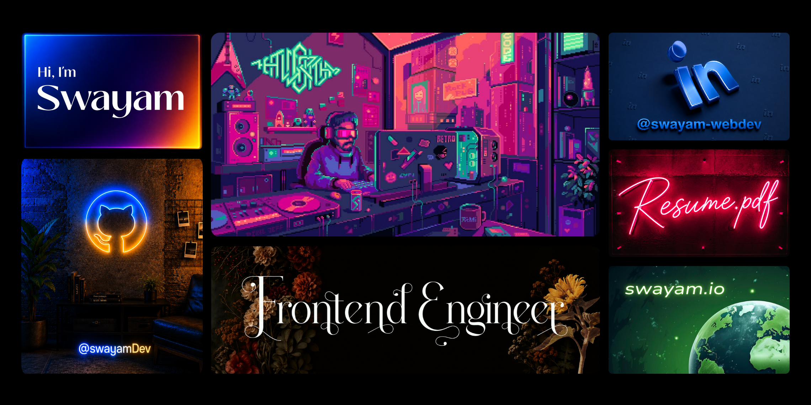

  

---

## 🌐 Connect With Me

---

## 💻 Tech Stack

### Frontend

### Styling & UI

### Animation & Creative Development

### State Management & Data Fetching

### Forms & Validation

### Backend & APIs

### Authentication & Security

### Databases & ORM

### Cloud & Deployment

### Design & Productivity

### Languages

---
